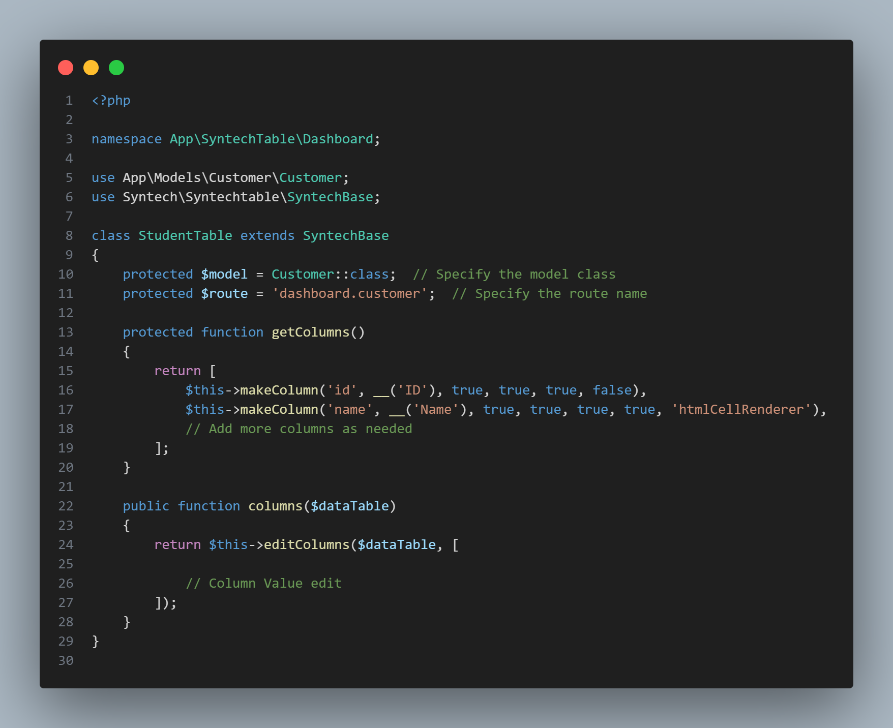

# SyntechTable

`SyntechTable` is a Laravel package for managing dynamic and customizable data tables with ease. This package is built on top of [AG Grid](https://github.com/ag-grid/ag-grid), a powerful and flexible data grid library.



## Installation

To install the package, run:

```bash
composer require syntech/syntechtable
```

##Usage
##Creating a New Table

To create a new table, use the Artisan command:

```bash
php artisan syntechtable:make Dashboard/StudentTable
```

## This command will create a new table class in App\SyntechTable\Dashboard\StudentTable.
Rendering the Table

## To render the table in your view, include the following HTML and Blade syntax in your Blade template:

```bash
<div id="myGrid" class="ag-theme-quartz" style="height: auto"></div>

{!! $scripts !!}
```


## This code sets up a container for your AG Grid table and includes the necessary JavaScript to initialize and configure the grid.

## Customizing Table Style

## You can customize the style of your AG Grid table by adding the following CSS to your Blade template or your application's CSS file:

```bash

<style>
    .ag-theme-quartz {
        /* Changes the color of the grid text */
        --ag-font-color: rgb(51, 51, 51);
        
        /* Changes the color of the grid background */
        --ag-background-color: rgb(241, 247, 255);
        
        /* Changes the header color of the top row */
        --ag-header-background-color: rgb(228, 237, 250);
        
        /* Changes the hover color of the row */
        --ag-row-hover-color: rgb(216, 226, 255);
    }
</style>


```

## This CSS snippet adjusts various colors in the AG Grid theme to match your design preferences.


## Configuration

## You can configure various aspects of the SyntechTable package through the configuration file. Publish the configuration file with:

```bash
php artisan vendor:publish --provider="Syntech\SyntechTable\Providers\SyntechTableServiceProvider"
```
